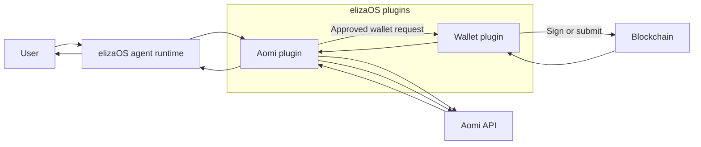
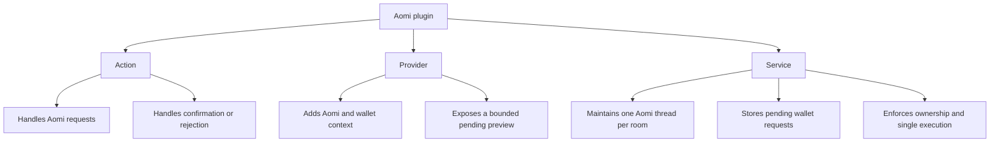
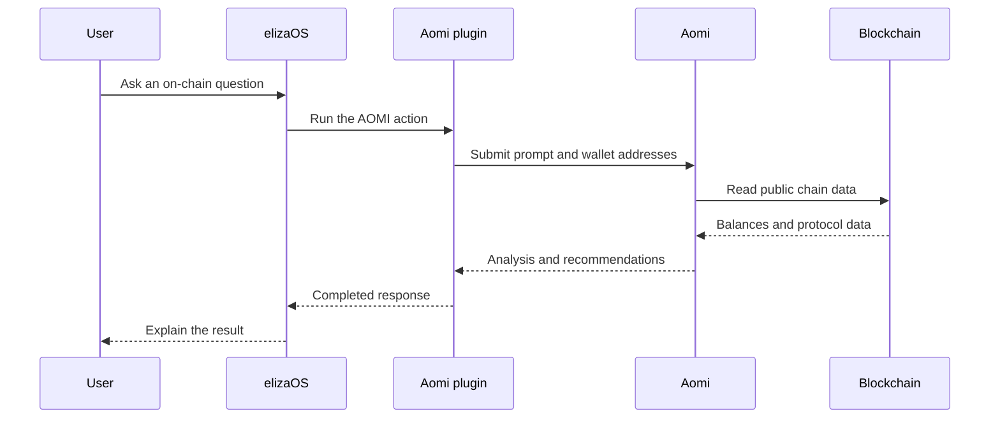
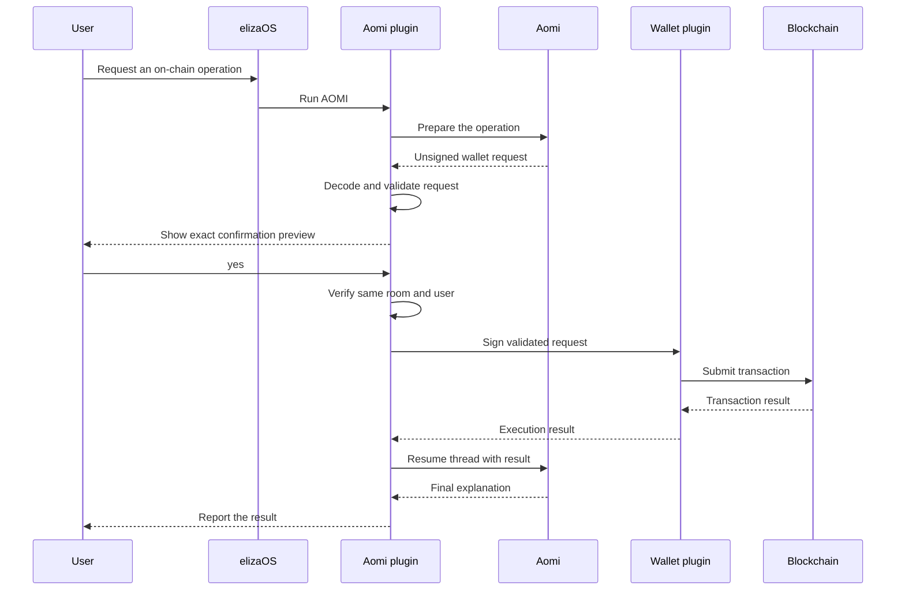
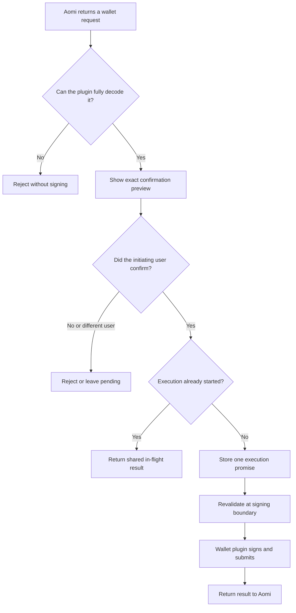
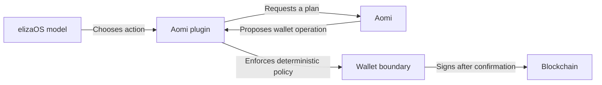

# Architecture

`@aomi-labs/eliza-plugin-aomi` connects an elizaOS agent to Aomi while
elizaOS retains wallet custody, transaction validation, and final approval.

The simplest mental model is:

- **elizaOS** is the conversational agent runtime.
- **Aomi** researches and plans on-chain work.
- **`@elizaos/plugin-wallet`** owns wallet access and signing.
- **This plugin** coordinates those systems and enforces the confirmation
  boundary.

## System overview



Aomi never receives the private key. It may propose a wallet operation, but it
cannot approve or sign that operation. The initiating user approves an exact
preview, and the configured wallet plugin performs the signing.

## elizaOS plugin surface

An elizaOS character installs both plugins:

```ts
plugins: [
  "@elizaos/plugin-wallet",
  "@aomi-labs/eliza-plugin-aomi",
];
```

The Aomi plugin registers an action, provider, and service:



### Action

`AOMI` is the only action. It handles:

1. A new request such as “use Aomi to inspect my idle assets.”
2. A later confirmation or rejection of a pending wallet operation.

Explicit Aomi requests are routed directly to this action. A separate
confirmation action is intentionally not used.

### Provider

`aomiProvider` supplies the model with bounded operational context:

- Aomi configuration and availability.
- Connected EVM and Solana addresses.
- A safe preview of any pending operation.

It does not expose API keys, wallet keys, signed payloads, or unrestricted
backend errors.

### Service

`AomiService` owns the durable conversational state:

- One Aomi `ClientSession` per elizaOS room.
- The pending wallet request for that room.
- The `entityId` of the user who initiated the operation.
- Shared execution and settlement promises used to prevent duplicate work.

This lets follow-up requests continue the same Aomi thread while keeping wallet
approval bound to the correct conversation and user.

## Read-only request

Read-only research does not require wallet confirmation:



The plugin sends connected public addresses to Aomi so it can contextualize the
request. It does not send wallet credentials.

## Wallet request

A wallet operation always takes at least two user turns:



The initial request authorizes planning only. It never authorizes the resulting
wallet write. LLM-supplied confirmation flags are ignored; confirmation state
is held by the runtime.

## Confirmation state machine



Pending confirmation is bound to:

- The elizaOS room.
- The exact Aomi request.
- The initiating user’s `entityId`.

The service stores the in-flight promise synchronously before awaiting wallet
execution. Concurrent `yes` messages therefore share one execution instead of
broadcasting the same transaction twice.

The wallet execution promise is retained separately from the Aomi callback. If
notifying Aomi fails, a retry may settle the Aomi request again but cannot
rebroadcast the blockchain transaction.

## Trust and authority



- The model decides when Aomi is an appropriate tool.
- Aomi proposes research or a wallet operation.
- Deterministic plugin code validates the proposed operation.
- The initiating user provides final approval.
- The wallet plugin signs and submits.

Model output cannot bypass the coded safety boundary.

## Wallet execution boundary

`src/wallet.ts` is the only signing and execution boundary. It reaches signing
through `WalletBackendService` supplied by `@elizaos/plugin-wallet`.

### EVM

The initial release supports:

- A single EVM transaction.
- EIP-712 typed-data signatures.
- Displayable message signatures.

The preview includes the chain, target, value, call data, or exact signature
payload. EVM batches are rejected until the wallet backend provides an atomic
batch primitive.

### Solana

The initial release deliberately supports only fully decoded native SOL
`SystemProgram.transfer` instructions. The preview includes:

- Fee payer and transfer source.
- Recipient.
- Amount in lamports and SOL.
- Program and instruction count.
- Payload byte length and hash.

The plugin rejects:

- SPL token instructions.
- Unknown programs.
- Address lookup tables.
- Non-transfer System Program instructions.
- A fee payer or transfer source that is not the connected wallet.
- Missing, malformed, opaque, or non-displayable signing payloads.

Unsupported Solana activity fails closed instead of asking the user to sign an
opaque byte sequence.

## Source map

| File | Responsibility |
| --- | --- |
| `src/index.ts` | Registers and exports the plugin |
| `src/action.ts` | Handles requests, confirmations, and rejections |
| `src/provider.ts` | Supplies bounded Aomi and wallet context |
| `src/service.ts` | Owns sessions, pending state, and single-flight execution |
| `src/routing.ts` | Routes explicit Aomi requests to the action |
| `src/wallet.ts` | Validates, previews, signs, and submits wallet requests |
| `src/wallet-backend.ts` | Defines the wallet-plugin service boundary |

